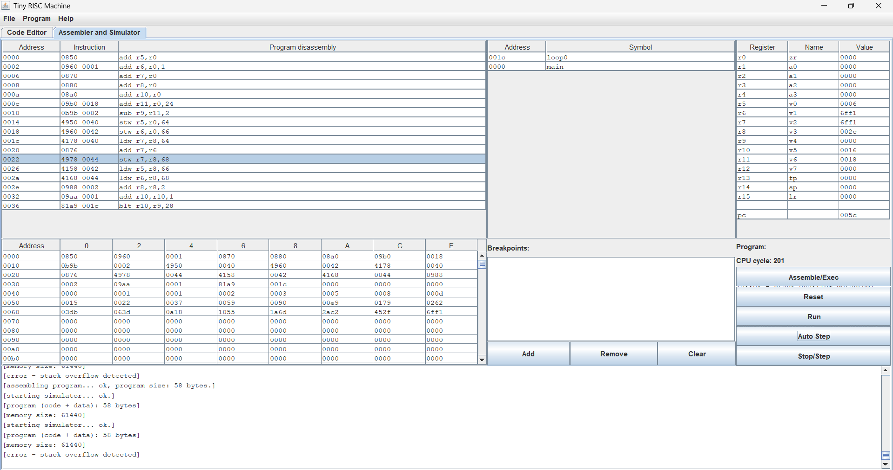
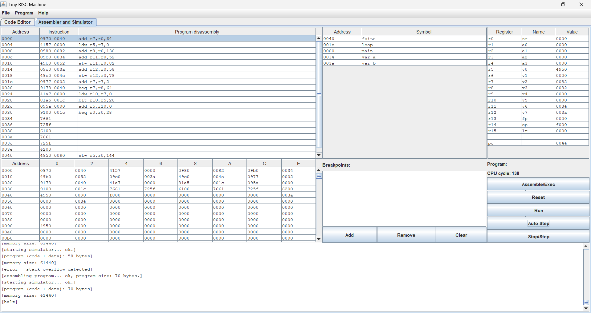
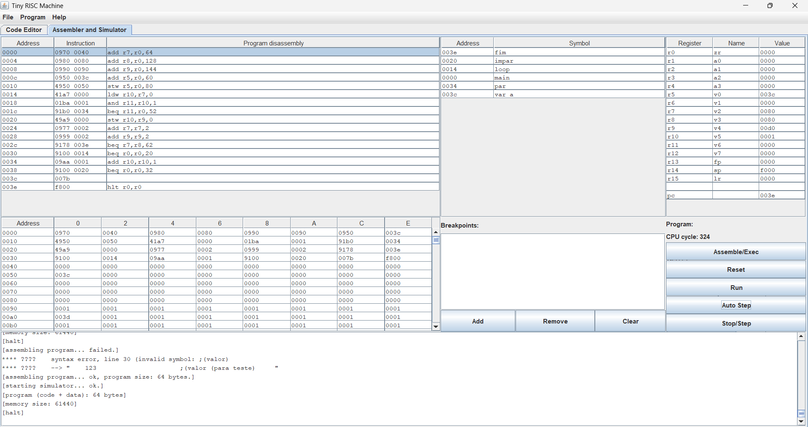
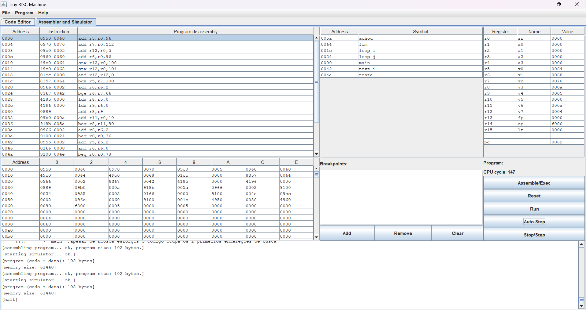
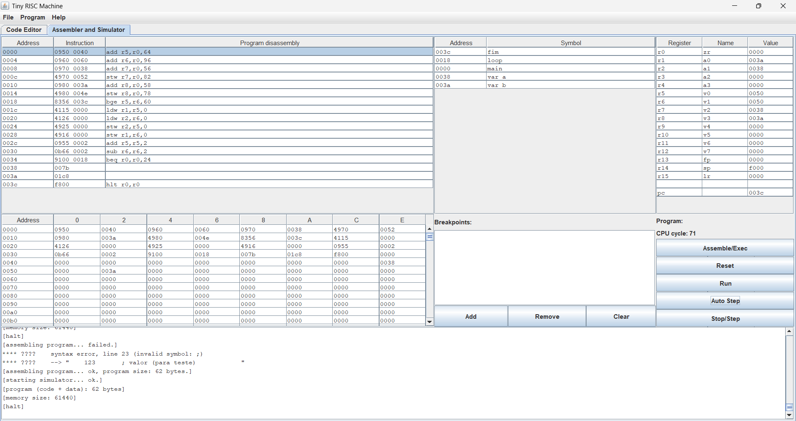

# Trab-Programa-o-no-Processador-TRM
# Enunciado: 
Cada dupla deverá elaborar e desenvolver programas para resolver os problemas
colocados abaixo na linguagem de montagem do processador TRM. Para validar o trabalho deverão
executar o código de montagem no simulador do processador TRM, conforme trabalhado em aula. Para
cada problema, os alunos deverão:
1. Escrever um parágrafo explicando o funcionamento do código em questão. Este parágrafo deve
ser adicionado a um arquivo README.md em seu repositório;
2. Salvar uma imagem ou print da tela do simulador, mostrando o estado da memória e
registradores após a execução do programa. As imagens deverão constar logo abaixo dos
parágrafos, também no arquivo README.md;
3. Salvar o código do programa em um arquivo separado dos demais.
# ATENÇÃO:
Seu repositório deverá conter apenas um arquivo README.md com todas as descrições
dos programas e prints de simulação, além de um arquivo para cada programa desenvolvido.

# Problema 1: 
Desenvolva um programa que escreva na memória os N primeiros números inteiros
ímpares maiores que zero. Seu programa deverá ser N da memória e funcionar para qualquer valor de
N. Os valores deverão ser escritos a partir do endereço 0x20 e aparecerem contiguamente na memória.

Funcionamento do código: Este código escreve na  memoria os N primeiros números Ímpares inteiros que são maiores do que zero, e os guarda a partir do endereço 0x20 em diante na memoria.

[1](Fotos_Exercicios/Foto_Questão1.png)

main

    add v0,zr,1        ; inicializa v0 = 1 
    add v2,zr          ; inicializa v2 = 0 

loop

    stw v0,v2,0x20     ; escreve v0 na memória 
    add v2,v2,2        ; v2 + 2
    add v0,v0,2        ; próximo número ímpar
    beq zr,zr,loop     ;loop
	

# Problema 2: 
Desenvolva um programa capaz de gerar os N primeiros números da sequência de
Fibonacci. Escreva cada número gerado na memória, a partir do endereço 0x30.

Funcionamento do código: Este programa gera os N primeiros números da sequencia de fibonacci e os escreve individualmente na memoria do endereço 0x30 em diante.

main

	add v0,zr	        ;0
	add v1,zr,1	        ;1
	add v2,zr	        ;n da sequencia
	add v3,zr	        ;indice do index
	add v5,zr	        ;(i)
	add v6,zr,24	    ;(n)
	sub v4,v6,2	        ;(N) = n-2
	stw v0,zr,0x40	    ;carrega o primeiro numero da sequencia
	stw v1,zr,0x42	    ;carrega o segundo numero

loop0

	ldw v2,v3,0x40	    ;carrega na v2 um dos anteriores
	add v2,v1	        ;soma o anterior que foi adicionado na v2 com o valor da v1
	stw v2,v3,0x44	    ;guarda o proximo numero da sequencia na memoria
	ldw v0,v3,0x42	    ;carrega o v1 no v0
	ldw v1,v3,0x44	    ;carrega o v2 no v1
	add v3,v3,2	        ;indice de navegação da memoria
	add v5,v5,1	        ;indice do "loop0"
	blt v5,v4,loop0	    ;volta para o "loop0"

# Problema 3: 
Escreva um programa para encontrar o maior número inteiro positivo escrito em memória
entre os endereços 0x40 e 0x80. O número encontrado deverá ser escrito na posição 0x90.

Funcionamento do código: Ele percorre todos os números do endereço 0x40 até o 0x80 e encotra o maior número inteiro positivo que estiver na memoria e o reescreve no endereço 0x90.

main

    add v2, zr, 0x40      ; v2 = 0x40 (início da busca)
    ldw v0, v2, 0         ; v0 = valor inicial em 0x40 
    add v3, zr, 0x82      ; v3 = limite final 
    add v6, zr, var_a     ; v6 = valor "var_a" (para teste)
    stw v6, zr, 0x52      ; salva "var_a" em 0x52
    add v7, zr, var_b     ; v7 = valor "var_b" (para teste)
    stw v7, zr, 0x4e      ; salva "var_b" em 0x4E

loop

    add v2, v2, 2         ; avança para próximo endereço
    beq v2, v3, feito     ; se chegou no fim, vai para feito
    ldw v5, v2, 0         ; lê valor atual da memória
    blt v5, v0, loop      ; se valor < maior, ignora e volta
    add v0, v5, 0         ; senão, atualiza maior valor
    beq zr, zr, loop      ; repete até o limite ser atingindo

var_a

    123                   ; valor de "var_a" (para teste)

var_b

    456                   ; valor de "var_b" (para teste)

feito

    stw v0, zr, 0x90      ; escreve o maior valor em 0x90
    hlt                   ; encerra o programa

# Problema 4: 
Escreva um programa que lê todos os valores escritos em memória entre as posições 0x40
e 0x80 e os escreve a partir da posição 0x90, somando 1 aos valores pares para que se tornem ímpares.
Assim, todos os 64 primeiros valores na memória a partir de 0x90 devem ser ímpares.

Funcionamento do código: O programa observa todos os valores entre 0x40 e 0x80 e os reescreve a partir do 0x90, e soma 1 a todos os pares que se tornam ímpares no processo. Fazendo assim todos os 64 números serem ímpares desde o 0x90 em diante.

main
    
    add   v2, zr, 0x40       ; v2 = início da leitura (0x40)
    add   v3, zr, 0x80       ; v3 = fim da leitura (0x80)
    add   v4, zr, 0x90       ; v4 = início da escrita na memoría (0x90)
    add   v0, zr, var_a      ; v0 = "var_a"
    stw   v0, zr, 0x50       ; salva "var_a" em 0x50

loop
    
    ldw   v5, v2, 0          ; carrega valor atual da memória em v5
    and   v6, v5, 1          ; testa se v5 é par (bit menos significativo)
    beq   v6, zr, par        ; se par, vai para "par"

impar

    stw   v5, v4, 0          ; escreve valor ímpar em destino
    add   v2, v2, 2          ; avança leitura
    add   v4, v4, 2          ; avança escrita
    beq   v2, v3, fim        ; se chegou ao fim (0x80), vai para "fim"
    beq   zr, zr, loop       ; repete "loop"

par

    add   v5, v5, 1          ; soma 1 ao par e torna ímpar
    beq   zr, zr, impar      ; volta pro "loop"

var_a
				
    123                      ;(valor (para teste)	

fim

    hlt                      ; fim do programa

# Problema 5: 
Escreva um programa que procura entre os endereços 0x60 e 0x70 por dois números cuja
soma seja igual a 10. Caso este números existam, a posição deles deverá ser escrita nos endereços 0x80 e 0x90.

Funcionamento do código: Este código procura por números dentro dos endereços 0x60 e 0x70 que somados tenham o resultado em 10, e então reposicionados nos endereços 0x80 e 0x90.

main				

    add v0, zr, 0x60		;v0 = 0x60 (inicio) ;apesar de noosos esforços o codigo ocupa os 2 primeiros endereçoes de busca
    add v2, zr, 0x70		;v2 = 0x70 (fim)
    add v7,zr,5			;numero teste
    add v1,zr,0x60		;v1 navega pela memoria
    stw v7,zr,0x64		;carrega  teste na memoria
    stw v7,zr,0x68		;carrega o teste na memoria
    and v7,v7,0			;zera a v7 para usala depois
	
loop_i

    bge v0, v2, fim		; se v0 >= v2 -> fim
    add v1, v1, 2		;v1 = v1 + 2 para começar a navegar 

loop_j
    
	bge v1, v2, next_i		;se v1 >= v2 -> próximo i
    ldw v3, v0, 0		;v3 = mem[v0]
    ldw v4, v1, 0		;v4 = mem[v1]
    add v3, v4			;soma dos dois numeros
    add v6, zr, 10		;v6 = 10 para verificar a soma
    beq v3, v6, achou		;se v3 == v6 achou
    add v1, v1, 2		;para continuar a navegação
    beq zr, zr, loop_j		;volta ao loop para continuar a busca

next_i
    
	add v0, v0, 2		;avançamos para a proxima coluna da memoria
    and v1,v1,0			;zeramos o v1 para começarmos da posiçao seguinte para que 
    beq zr, zr, teste		;os indices nao se encontrem

teste
    
	add v7,v7,2			;add 2 na v7 para fins de navegaçao
    add v1,v7,0x60		;adicionamos o proximo endereço na v1 para que seja somada novamente no loop_i
    beq zr,zr,loop_i		;sem erros assim permitindo todas s combinaçoes de endereço(essa parte foi dificil)

achou
    
	stw v0, zr, 0x80		; grava posições em 0x80 e 0x90
    stw v1, zr, 0x90
    hlt

fim

    hlt

# Problema 6: 
Escreva um programa que inverte a ordem dos valores compreendidos entre os endereços
0x40 e 0x60, isto é, os valores deverão aparecer "de trás pra frente" na memória. Você não deverá ler
ou escrever em endereços de memória fora do intervalo entre 0x40 e 0x60.

Funcionamento do código: Este programa em específico inverte todos os números de trás pra frente somente entre os endereços 0x40 e 0x60.

main

    add v0, zr, 0x40      ; v0 = início do intervalo (0x40)
    add v1, zr, 0x60      ; v1 = fim do intervalo (0x60)
    add v2, zr, var_a     ; v2 = "var_a"
    stw v2, zr, 0x52      ; salva "var_a" em 0x52
    add v3, zr, var_b     ; v3 = "var_b"
    stw v3, zr, 0x4e      ; salva "var_b" em 0x4e

loop

    bge v0, v1, fim       ; se v0 >= v1, terminou 
    ldw a0, v0, 0         ; carrega valor no v0 para a0
    ldw a1, v1, 0         ; carrega valor no v1 para a1
    stw a1, v0, 0         ; escreve valor de a1 no registrador v0
    stw a0, v1, 0         ; escreve valor de a0 no registrador v1
    add v0, v0, 2         ; avança ponteiro do início
    sub v1, v1, 2         ; recua ponteiro do "fim"
    beq zr, zr, loop      ; volta para o loop

var_a
			  
    123       ; valor (para teste)            

var_b
			  
    456       ; valor (para teste)            

fim

    hlt                   ; fim do programa

# Problema 7: (escolha de questõ a não ser feita)
Assuma uma matriz MxN, onde M está escrita no endereço 0x40, N está escrito no
endereço 0x42 e os valores da matriz iniciam no endereço de memória 0x44. Escreva um programa que
escreve os elementos da diagonal principal a partir do endereço 0x100. Seu programa deve funcionar
para qualquer matriz de tamanho MxN < 64.

# Problema 8: 
Escreva um programa que escreve seu nome completo na saída do simulador. Se estiver
trabalhando com uma dupla, escreva o nome de ambos os alunos. Exemplos de escrita na saída do
simulador podem ser encontrados na pasta exemplo.

Funcionamento do código: Escreve o nome completo de todos os integrantes do grupo na saída do simulador.

main

	add a0, zr, text        ; a0 aponta para o início da string "text"
	
loop

	ldb v0, a0              ; carrega 1 byte da string (caractere) em v0
	stw v0, zr, 0xf006      ; envia caractere para a saída do simulador
	beq v0, zr, end         ; se caractere == 0 (fim da string), vai para "end"
	add a0, a0, 1           ; incrementa ponteiro para o próximo caractere
	beq zr, zr, loop        ; volta para o loop

end

	add v0, zr, 10          ; print nova linha
	stw v0, zr, 0xf006      
	hlt                     ; fim da execução

text	

	"Alexandre, Gabriel, Gabriel, Gianlucca" ; string com os nomes

Funcionamento do código: Escreve o nome completo de todos os integrantes do grupo na saída do simulaor.

# Problema 9: 
Escreva um programa que identifique se uma palavra é palíndrome. O número de
caracteres na palavra deve ser lido do endereço 0x60 da memória, enquanto a palavra deve iniciar no
endereço 0x70.

# Problema 10: 
Escreva um programa que conta o número de cada vogal em uma palavra. O número de
letras A, E, I, O e U devem ser escritos, respectivamente, nos endereços 0x40, 0x44, 0x48, 0x50 e
0x52. A palavra deve ser lida a partir do endereço 0x60. A quantidade de letras na palavra deve ser lida do endereço 0x58
